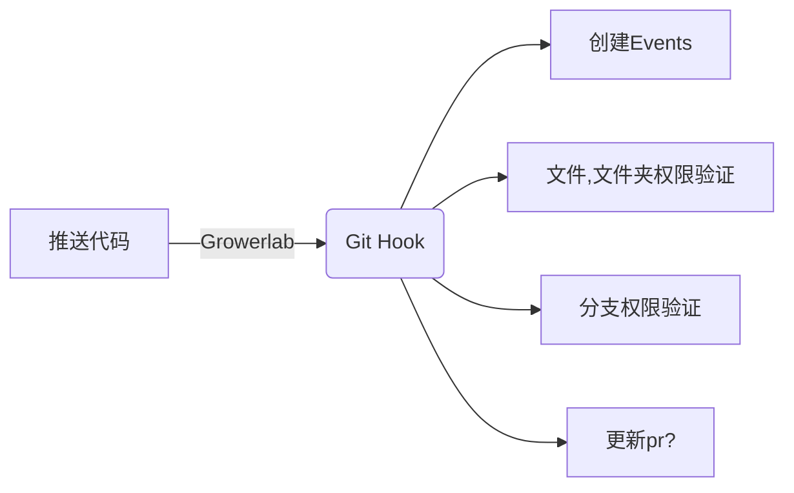

## Hulk

#### Growerlab - git hook

推送时的运行钩子

通过执行 git -c core.hooksPath 注入钩子

运行时，该程序应放在根目录的 hooks 目录下



#### TODO

- [ ] 支持自检（确认相关的配置是正确的） 

#### 钩子环境

钩子执行时传入的参数、环境变量

##### 环境变量

```shell
GIT_ALTERNATE_OBJECT_DIRECTORIES=/Users/moli/go-project/src/github.com/growerlab/mensa/test/repos/mo/te/moli/test/./objects
GIT_DIR=.
GIT_EXEC_PATH=/Applications/Xcode.app/Contents/Developer/usr/libexec/git-core
GIT_OBJECT_DIRECTORY=/Users/moli/go-project/src/github.com/growerlab/mensa/test/repos/mo/te/moli/test/./objects/incoming-lRoOgD
GIT_PUSH_OPTION_COUNT=0
GIT_QUARANTINE_PATH=/Users/moli/go-project/src/github.com/growerlab/mensa/test/repos/mo/te/moli/test/./objects/incoming-lRoOgD
```

### 参数

标准输入 3 个参数

1. old commit
2. new commit
3. Ref
   - refs/heads/master
   - refs/tags/v1.0

#### 环境变量参数

```shell
ENV                       // 运行环境(dev,local,production)
GROWERLAB_REPO_OWNER      // 仓库所有者
GROWERLAB_REPO_NAME       // 仓库名称
GROWERLAB_REPO_ACTION     // pull/push
GROWERLAB_REPO_PROT_TYPE  // ssh/http
GROWERLAB_REPO_OPERATOR   // 操作者
```

#### 参数描述

update hook 会接受 3 个参数

1. old commit
2. new commit
3. Ref
   - refs/heads/master
   - refs/tags/v1.0

##### 普通 commit

第一次commit提交
```
ref: refs/heads/master
new commit: 7032e1c57ddcc19d53acd64cd0aa1c3942099a0e
old commit: 0000000000000000000000000000000000000000
```

普通commit提交
```
ref: refs/heads/master
new commit: b26e38a1f1439628d8d4f7ed06b2fc233239a0bb
old commit: 7b10d02abbffea5de7bc00ac1f9d6d602e5dfe18
```

##### 新增分支

```
ref: refs/heads/master2
new commit: b26e38a1f1439628d8d4f7ed06b2fc233239a0bb
old commit: 0000000000000000000000000000000000000000
```

##### 删除分支

```
ref: refs/heads/master2
new commit: 0000000000000000000000000000000000000000
old commit: b26e38a1f1439628d8d4f7ed06b2fc233239a0bb
```

##### 新增 tag

```
ref: refs/tags/v1.0
new commit: 8aa1cfdb6e50c43c54576f36e6bbccfb6ed9644d
old commit: 0000000000000000000000000000000000000000
```

##### 删除 tag

```
ref: refs/tags/v1.0
new commit: 0000000000000000000000000000000000000000
old commit: b2af857c460d3fec04940a973646c4a01024f202
```
