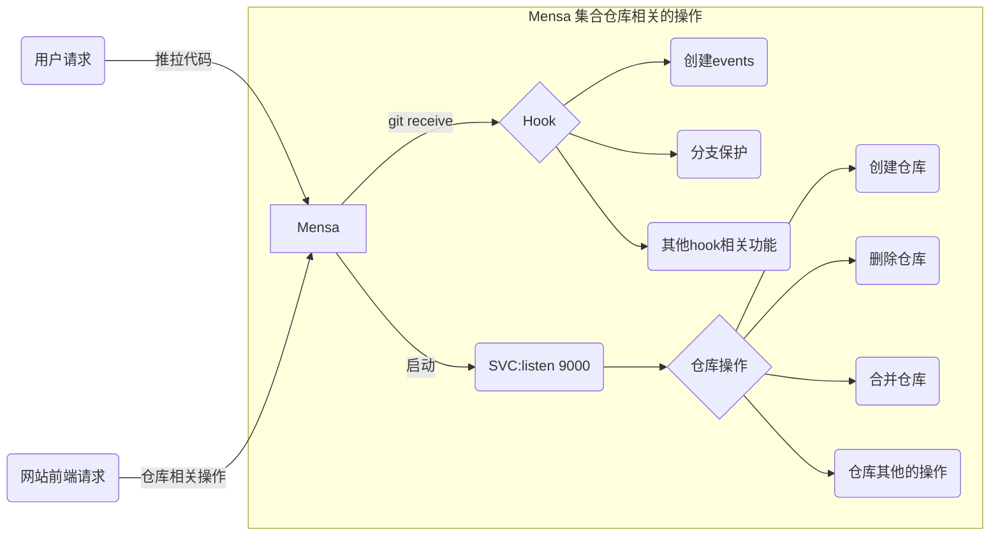

# mensa

Rethinking the git transport protocol

### 环境变量

`ENV=local`      本地环境
`ENV=dev`        测试环境
`ENV=production` 生产环境

`NOAUTH=true` 关闭验证（主要用于测试推拉等功能）

### TODO

- [x] HTTP Server
- [x] SSH Server
- [ ] Archive
- [x] Authenticate

#### 流程图

Mensa

